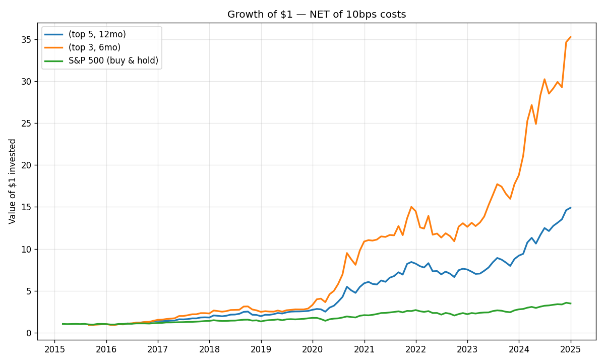

# Momentum Strategy vs S&P500 returns
A simple test of whether stock-price **momentum** beats buying and holding the S&P 500.

## The question
Do stocks that rose the most over the past 12 months keep outperforming? I test a
classic momentum strategy and compare it to a passive S&P 500 benchmark.

## Method
- **Universe:** 20 large-cap U.S. stocks, 2015–2025.
- **Signal:** trailing 12-month and 6-month return (momentum), measured each month.
- **Rule:** each month, hold the 5 or 3 highest-momentum stocks, equal-weighted; rebalance monthly.
- **Benchmark:** buy and hold SPY (S&P 500 ETF).
- **No look-ahead:** the signal at each month uses only data available at that point.
- **Tools:** Python, pandas, yfinance, matplotlib.

## Results (top 3, 6 month)
| Metric | Momentum | S&P 500 |
|---|---|---|
| Total return | 47.0% | 13.5% |
| CAGR | 46.0% | 13.5% |
| Sharpe ratio | 1.46 | 0.9 |
| Max drawdown | -27.3% | -23.9% |

**What I found:** 
- Trading based on last six month return and taking top 3 stocks/month generates highest returns (including 10bps trading cost assumption)
- Momentum did beat S&P returns and did survive the transaction costs

## Limitations (important)
- Only large-cap U.S. stocks over one market regime — results may not generalize.
- Survivorship: the ticker list is today's well-known names.
